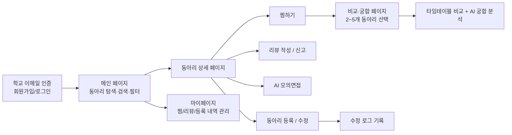
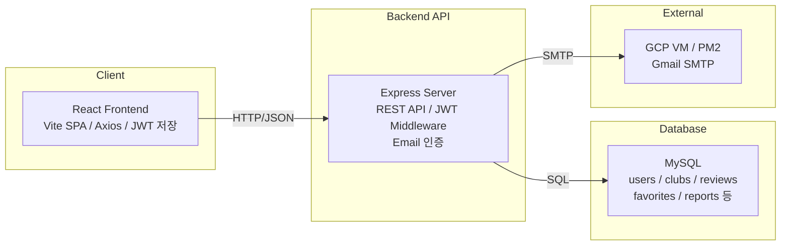
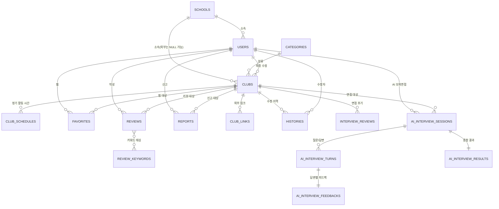

<div align="center">

<!-- 📸 로고 이미지 자리 -->


# MOARI (모아리)

### 흩어진 동아리 정보를 한 곳에, AI로 더 스마트하게

</div>

<br>

## 📖 프로젝트 소개

**MOARI**는 학교 이메일 인증을 기반으로 교내·연합(외부) 동아리 정보를 통합 제공하는 동아리 정보 플랫폼입니다.

기존 에브리타임(게시글 기반이라 정보가 쉽게 묻힘), 캠퍼스픽(외부 동아리 중심으로 정보 제한적) 등 기존 서비스의 한계를 보완해, **구조화된 정보 + 리뷰/신고 기반 신뢰도 + AI 추천**을 한 곳에서 제공합니다.

- ✅ 교내 + 외부 동아리 **통합 검색/필터링**
- ✅ 여러 동아리를 놓고 **일정·활동 궁합을 AI가 분석**
- ✅ 동아리 정보를 바탕으로 **AI 모의면접** 연습
- ✅ 리뷰·신고 기반 **신뢰도 있는 정보 제공**
- ✅ 누구나 정보 등록·수정 가능한 **개방형 구조 + 수정 이력 관리**


### 👥 팀 구성

| 학번 | 이름 | 역할 |
|---|---|---|
| 20240996 | 권수정 | |
| 20231129 | 김민경 | |
| 20241010 | 안다현 | |
| 20231155 | 이정현 | |
| 20231169 | 최은솔 | 수정로그, 검색/필터링, ai모의면접 |

<br>

## ✨ 주요 기능

### 1. 🔎 교내/외부 통합 검색

<!-- 📸 스크린샷 자리 -->


하나의 탐색 페이지에서 교내·외부 동아리를 함께 검색합니다.

- 동아리명/소개/활동내용 키워드 검색
- 카테고리, 모집 여부, 학교(전체/교내/외부) 필터
- 인기순 / 별점순 / 이름순 정렬

<br>

### 2. 🤝 AI 동아리 비교·궁합

<!-- 📸 스크린샷 자리 -->


관심 있는 동아리 2~4개를 골라 함께 활동했을 때의 적합성을 AI가 분석해줍니다.

- **활동 가능 시간 타임테이블**: 웬투밋처럼 내 활동 가능 시간을 입력하고, 동아리별 정기 모임 시간을 색상으로 겹쳐 보여줘 **일정 충돌을 시각적으로 확인**
- **비교 표**: 카테고리, 활동 강도, 친목 비중, 회비, 면접 난이도 등 항목별 비교
- **AI 추천 궁합**: 일정 충돌 / 활동 시너지 / 병행 강도 / 예산 부담도 4가지를 종합해 최적 조합 1가지 자동 추천
- **내가 직접 고르는 궁합**: 원하는 조합을 직접 선택해 반복 비교 가능

<br>

### 3. 🎤 AI 모의면접

<!-- 📸 스크린샷 자리 -->


동아리 소개, 모집 정보, 실제 면접 후기를 바탕으로 AI가 예상 질문을 생성하고 답변을 피드백합니다.

- **STEP 1. 면접 설정**: 질문 수 선택(5/7/10개)
- **STEP 2. AI 모의면접 진행**: 실제 면접 질문 → 면접정보 기반 예상 질문 → 동아리 정보 기반 질문 → 일반 질문 순으로 출제, 답변에 따라 꼬리질문 생성
- **STEP 3. 결과·피드백**: 지원동기/논리성/경험 구체성/일관성/동아리 적합성 항목별 분석 + 취약점 재면접 지원

> 동아리 정보 + 면접 후기 → **Gemini API** → 예상 질문·피드백·결과

<br>

### 4. ⭐ 리뷰 & 🚨 신고

<!-- 📸 스크린샷 자리 -->


- 리뷰: 별점 + 활동 강도/친목 비중 슬라이더 + 특징 키워드(복수 선택) + 상세 후기, 동아리당 1개만 작성 가능, 본인 리뷰만 삭제 가능
- 신고: 허위정보/부적절한 광고/차별·혐오/기타 사유 선택 후 접수, **5회 이상 누적 시** 상세 페이지에 경고 문구 + 주요 신고 사유 노출

<br>

### 5. 🕘 수정 로그 (History Log)

<!-- 📸 스크린샷 자리 -->


누구나 동아리 정보를 수정할 수 있는 개방형 구조이기 때문에, **누가·언제·무엇을·어떻게 수정했는지** 이력을 시간순으로 확인할 수 있습니다. (수정 전/후 값, 수정자, 수정일시)

또한 **1년 이상 수정되지 않은 동아리**는 상세 페이지에 안내 문구를 노출해 정보 신뢰성을 유지합니다.

<br>

### 🧭 사용자 흐름 (User Flow)



<br>

## 🛠️ 기술 스택

| 구분 | 기술 |
|---|---|
| **Frontend** |     |
| **Backend** |   |
| **Database** |  |
| **AI** |  동아리 궁합 분석 / 모의면접 질문·피드백 생성 |
| **Infra** |     |
| **협업** |    |

<br>

## 🏗️ 시스템 아키텍처 및 구조

### HLD (High Level Design)



<br>

### ERD (핵심 테이블 요약)



> 상세 컬럼/제약조건은 저장소 내 `schema.sql` 참고

<br>

## 🚀 실행 방법 (Getting Started)

> 백엔드는 **GCP VM에서 24시간 상시 운영 중**이라 별도로 실행할 필요가 없습니다. 프론트엔드만 아래대로 실행하면 바로 서비스에 연결됩니다. (백엔드 코드는 참고용으로 저장소만 열람하면 됩니다)

```bash
# 1. 프론트엔드 레포지토리 클론
git clone https://github.com/4-MOARI/MOARI_FE.git
cd MOARI_FE

# 2. 패키지 설치
npm install

# 3. 루트에 .env 파일 생성 후 아래 내용 입력
VITE_API_BASE_URL=http://34.50.19.72:3000/api

# 4. 개발 서버 실행
npm run dev
```

실행 후 브라우저에서 `http://localhost:5173` 접속

### 🔑 평가용 테스트 계정

| 아이디 | 비밀번호 | 소속 학교 |
|---|---|---|
| moari | test1234 | 성신여대 |
| EWHA | test1234 | 이화여대 |

> ⚠️ 계정은 실제 학교 이메일 기반으로 생성되었으니 개인정보 노출에 주의해주세요.

### 🔗 링크
- 프론트엔드: https://github.com/4-MOARI/MOARI_FE
- 백엔드: https://github.com/4-MOARI/MOARI_BE
- 데모 영상: [Google Drive 링크](https://drive.google.com/file/d/1VSbkFYU7yCl9Jg1EJLHRPy6kiQfk3iWT/view?usp=sharing)

<br>

---

<div align="center">

**MOARI** — 흩어진 동아리 정보를 하나로

</div>
